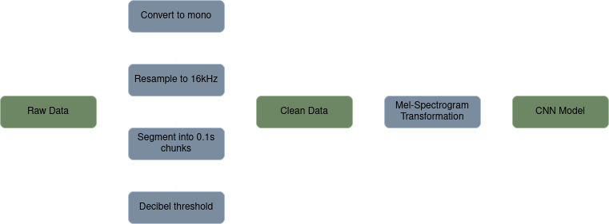

# DrumClassifier

A convolutional neural-network (CNN) for classifying drum instruments (hi-hats, kicks, and snares).

## **About**

`DrumClassifier` is the classifier model used for my [`DrumTracker`](https://github.com/xFiveRivers/drum-tracker) MIDI transcription program built with `PyTorch` and `TorchAudio`.

## **Installation**

Instructions for installation of the `drum-tracker` environment are the same as the ones found [here](https://github.com/xFiveRivers/drum-tracker).

## **Data**

The classifier is trained on percussion samples that I frequently use in hip-hop production. They are low-fidelity in nature and are what you would typically hear in old-school or boom-bap hip-hop tracks.

### **Data Processing**

In order to do classification that is some-what robust to generalization and accurate, some data processing is required. A flowchart of the pre-processing steps can be found below.

1. The data is first converted from stereo to mono to reduce dimensionality.

2. Then down-sampled from 44100kHz to 16000kHz to decrease memory while still retaining sonic information.

3. Each sample is then segmented into $\frac{1}{10}$ of a second chunks to synthetically increase the total amount of training data.

4. Then each chunk that falls below an average decibel threshold is discarded to remove quiet samples.

5. All data transformed up to this point is now considered `clean` data.

6. A `mel-spectrogram` transformation is then applied to the clean data to be used with a `PyTorch` dataloader for the model.

